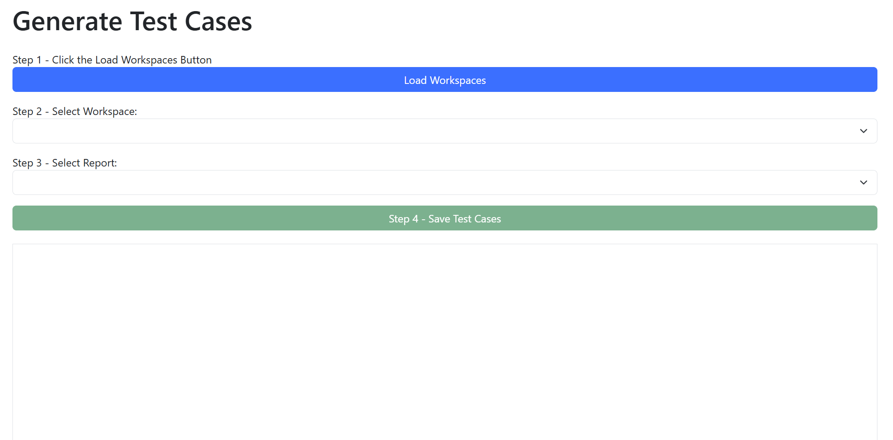
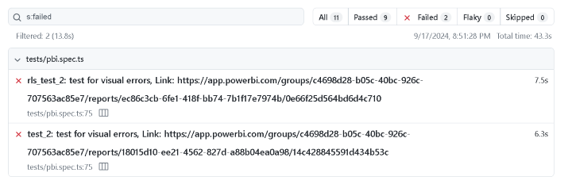

# pbi-dataops-visual-error-testing

Templates for testing Power BI reports for broken visuals using PowerShell and Microsoft Playwright. This project provides a robust framework to automate testing, ensuring that Power BI reports render correctly without broken visuals that could impact user experience.

## Table of Contents

- [pbi-dataops-visual-error-testing](#pbi-dataops-visual-error-testing)
  - [Table of Contents](#table-of-contents)
  - [Prerequisites](#prerequisites)
  - [Setup](#setup)
    - [1. Copy the Project](#1-copy-the-project)
    - [2. Anatomy of the Project](#2-anatomy-of-the-project)
    - [3. Update Environment Variables](#3-update-environment-variables)
    - [4. Add Test Cases](#4-add-test-cases)
      - [PowerShell Approach](#powershell-approach)
      - [User Interface Approach](#user-interface-approach)
      - [Paginated Report Support](#paginated-report-support)
        - [Multiple Value Parameters](#multiple-value-parameters)
    - [5. Run the Tests Locally](#5-run-the-tests-locally)
  - [Reading the Results](#reading-the-results)
  - [Broken Visuals](#broken-visuals)
  - [Continuous Integration](#continuous-integration)
  - [Limitations](#limitations)

## Prerequisites

Before setting up the project, ensure that the following prerequisites are met:

1. **Install VSCode**  
   Download and install Visual Studio Code from [here](https://code.visualstudio.com/).

2. **Install Node**  
   Install Node.js and npm from [here](https://nodejs.org/). This is required to run Playwright and other JavaScript-based tools.

3. **Power BI Licensing**  
   Ensure your Power BI workspace is within at least a Premium Per User Capacity. This is necessary for programmatic access and automation capabilities.

4. **Create App Service Principal**  
   A service principal is required to authenticate and perform actions in the Power BI service.
   - Go to the Azure portal to register a new application and create a service principal.
   - Provide the following API permissions with admin consent granted:
     - `App.Read.All`
     - `Dataset.Read.All`
     - `SemanticModel.Read.All`
     - `Report.Read.All`
     - `Workspace.Read.All`
   - Create a secret for the service principal.
   - Note down the **Client ID**, **Tenant ID**, and **Client Secret** as these will be needed for configuration later.

5. **Enable XMLA Endpoint Access**  
   Set up the XMLA endpoint for your workspace. Ensure that the workspaces being tested are set to the correct level and that necessary users or the service principal have **Member** rights to the workspaces.

6. **Setup Playwright**  
   Install and set up Playwright for testing. Follow the setup instructions provided in the [Playwright documentation](https://playwright.dev/docs/getting-started-vscode).

## Setup

### 1. Copy the Project

1. **Download from Releases**  
   Navigate to the Releases section of this GitHub repository and download the <a href="https://github.com/kerski/pbi-dataops-visual-error-testing/releases">latest release</a>.

2. **Unzip the File**  
   Extract the contents of the downloaded release.

3. **Open in Visual Studio Code**  
   Open the extracted project folder in Visual Studio Code.

### 2. Anatomy of the Project

The project consists of several key files and folders:

1. **template.env**  
   A template file where environment variables are stored. This includes the client secret for the service principal.

2. **test**  
   Contains the `pbi.spec.ts` file, which is the core code that executes the tests.

3. **helper-functions**  
   This folder includes a set of reusable functions and interfaces that support `pbi.spec.ts`.

4. **global-setup.ts**  
   Runs before any test and is used for global test setup. Currently, it logs some results to the console.

5. **test-cases**  
   This folder contains CSV files that define specific test cases. Refer to the [CSV Section](https://github.com/kerski/get-powerbireportpagesfortesting) for more details.

6. **playwright.config.* files**  
   Configuration files for Playwright that define how tests are executed. The default configuration file is `playwright.config.ts`.

7. **pipeline-scripts**  
   Contains scripts that define how Playwright tests are executed in Azure Pipelines.

### 3. Update Environment Variables

1. **Rename `template.env` to `.env`**  
   This `.env` file will be used to store environment-specific configurations.

2. **Set the following variables in the `.env` file:**
   - `CLIENT_ID=""`  
     Set this to the Client ID obtained from the prerequisites.
   - `CLIENT_SECRET=""`  
     Set this to the Client Secret created in the prerequisites.
   - `TENANT_ID=""`  
     Set this to the Tenant ID obtained from the prerequisites.
   - `ENVIRONMENT=""`  
     Set this to identify the tenant type (public or sovereign) where your Power BI service is located. Valid values are: Public, Germany, China, USGov, USGovHigh, or USGovDoD.
   - `EFFECTIVE_USERNAME=""`  
     Set this to a User Principal Name you want to use for RLS testing. This account is used for impersonation when rendering RLS-based reports.

3. **Save the `.env` file** after updating all the necessary environment variables.

### 4. Add Test Cases

For generating test cases there are two approaches. The first approach is the PowerShell approach where you generate the test cases based on a PowerShell module.  This approach is helpful you understand PowerShell and if you are looking to generate test cases automatically in build pipelines.  The second approach is the User Interface (UI) approach 

#### PowerShell Approach

1. **Open Terminal in Visual Studio Code**  
   In Visual Studio Code, open the terminal by selecting **Terminal > New Terminal**.

2. **Run the generate-test-cases script** Execute the following command: 
   ```bash
   \.generate-test-cases.ps1
3. **Respond to the prompts with which include**:
   - client_id - The id created by the service principal
   - client_secret - The secret by the service principal
   - tenant_id - The Tenant ID for the service principal
   - dataset_id - The Semantic Model/Dataset GUID to be tested
   - workspace_id - The Workspace GUID
   - role_user_name - Your email address/UPN
4. This will generate a test-case.csv file in the test-cases folder.


#### User Interface Approach

1.  **Open Terminal in Visual Studio Code**
   In Visual Studio Code, open the terminal by selecting **Terminal > New Terminal**.
2.  **Navigate to test-generation folder** 
      Execute the following command:
      ```bash
      cd test-generation
3.  **Install application** 
      Execute the following command:
      ```bash
      npm install
4.  **Start application** 
      Execute the following command:
      ```bash
      node app.js
5.  **Open Browser** 
    Open your browser of choice and enter "http://localhost:3000" in the address bar. 

   

6.  **Generate Test**
    Follow the instructions on the page to generate tests for a specific report.

#### Paginated Report Support

Test generation now supports Paginated Reports <u>that use Semantic Models for sources</u> and will test for error modals that appear on the screen.  


When a test is generated for a Paginated Report it will create a JSON file that produces an array of test cases.  By default, a test case will be created that tries loading the paginated report and checks for errors.  

Each test has the following properties:

- test_case: A unique identifier for the test case.
- workspace_id: The GUID of the Power BI workspace where the report resides.
- report_id: The GUID of the Power BI report being tested.
- report_name: The name of the report being tested.
- dataset_ids: An array of semantic models associated with the report. Each semantic model contains:
  - id: The GUID of the semantic model.
  - xmlaPermissions: The permissions level for the semantic model.
  - wait_seconds: The number of seconds to wait before performing the next action in the test (e.g., 20).

If the paginated reports have parameters, it will create a template set of parameters within the JSON property `report_parameters`.  You will need to replace the null value with an actual value so the test will pass those parameters to the report and render in the test.


##### Multiple Value Parameters

If you have a parameter that requires multiple values, you can repeat the name, value pair within the report_parameters properties to pass multiple parameters into the paginated report during the test.


### 5. Run the Tests Locally

1. **Open Terminal in Visual Studio Code**  
   In Visual Studio Code, open the terminal by selecting **Terminal > New Terminal**.

2. **npm install** Execute the following command: npm install.
   ```bash
   npm install
3. **npx playwright install** Execute the following command:        
   ```bash
   npx playwright install
4. **Run Playwright Tests**  
   Execute the following command to run Playwright tests locally:
   ```bash
   npx playwright test --workers=2
5. The tests will run in the following sequence:
   - Authenticate the service principal with the Power BI service.
   - Generate an embed token for the report page to be tested.
   - Verify that the rendered report does not contain broken visuals.


## Reading the Results

1. **Open the `playwright-report` Folder**  
   After the tests have run, open the `playwright-report` folder generated by Playwright.

2. **View the Report**  
   Double-click on `index.html` to open the report in a web browser. This report will show detailed test results.



## Broken Visuals

This testing tool will look for various issues in Power BI visuals as described in the official documentation on troubleshooting tile errors. The types of errors detected include:

1. Power BI encountered an unexpected error while loading the model.

2. Couldn't retrieve the data model.

3. You don't have permission to view this tile or open the workbook.

4. Power BI visuals have been disabled by your administrator.

5. Data shapes must contain at least one group or calculation that outputs data. 

6. Can't display the data because Power BI can't determine the relationship between two or more fields.

7. The groups in the primary axis and the secondary axis overlap. Groups in the primary axis can't have the same keys as groups in the secondary axis.

8. This visual has exceeded the available resources. 

9. We are not able to identify the following fields: {0}.

10. Couldn't retrieve the data for this visual. 

## Continuous Integration

To automate these tests in Azure DevOps please see these [instructions](/documentation/ci-mode.md)

## Limitations

1. Testing reports that use [composite models](https://learn.microsoft.com/en-us/power-bi/transform-model/desktop-composite-models) does not work due to a limitation with Microsoft's [PowerBI-JavaScript](https://github.com/microsoft/PowerBI-JavaScript) library.  Trying to test reports that use composite models will always indicate a broken visual with this tool.