# Continuous Integration

You can automate the testing for broken visuals using Azure DevOps. Please see the instructions below to set up a pipeline.

## Table of Contents

- [Continuous Integration](#continuous-integration)
  - [Table of Contents](#table-of-contents)
  - [High-Level Process](#high-level-process)
  - [Prerequisites](#prerequisites)
  - [Instructions](#instructions)
    - [Clone Repo](#clone-repo)
    - [Local Test Results](#local-test-results)
    - [Create the Variable Group](#create-the-variable-group)
    - [Create the Pipeline](#create-the-pipeline)
  - [Monitoring](#monitoring)

## High-Level Process

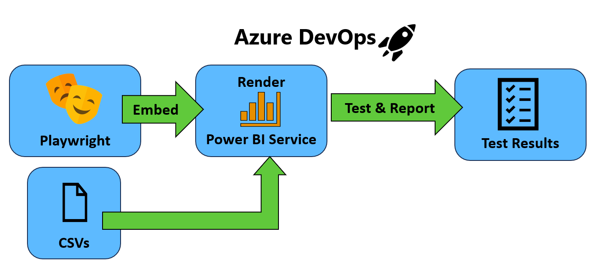  
*Figure 1 -- High-level diagram of automated testing for broken visuals*

In the visual depicted in Figure 1, the CSV files for the tests to be conducted are stored in the repository. They can be generated using the PowerShell module as described in [generating test cases](../README.md#4-add-test-cases).

An Azure Pipeline example is provided and is triggered to run every six hours, but you can update it for your testing purposes.

## Prerequisites

1. You have an Azure DevOps project and have at least Project or Build Administrator rights for that project.

2. You have connected a Premium-backed capacity workspace to your repository in your Azure DevOps project. Instructions are provided [at this link](https://learn.microsoft.com/en-us/power-bi/developer/projects/projects-git).

3. Your Power BI tenant has [XMLA Read/Write Enabled](https://learn.microsoft.com/en-us/power-bi/enterprise/service-premium-connect-tools#enable-xmla-read-write).

4. A service principal is required to authenticate and perform actions in the Power BI service.
   - Go to the Azure portal to register a new application and create a service principal.
   - Provide the following API permissions with admin consent granted:
     - `App.Read.All`
     - `Dataset.Read.All`
     - `SemanticModel.Read.All`
     - `Report.Read.All`
     - `Workspace.Read.All`
   - Create a secret for the service principal.
   - Note down the **Client ID**, **Tenant ID**, and **Client Secret**, as these will be needed for configuration later.

5. Ensure that the workspaces being tested have set the service principal to have **Member** rights to the workspaces.

## Instructions

### Clone Repo

1. Import the repository into your Azure DevOps project. Instructions are [provided here](https://learn.microsoft.com/en-us/azure/devops/repos/git/import-git-repository?view=azure-devops). The Clone URL is "https://github.com/kerski/pbi-dataops-visual-error-testing.git".

### Local Test Results

1. Put the CSV files for testing into the test-cases folder.

### Create the Variable Group

1. In your project, navigate to the **Pipelines -> Library** section.

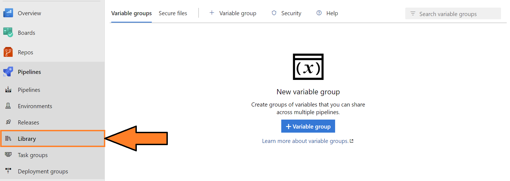

2. Select the "Add Variable Group" button.

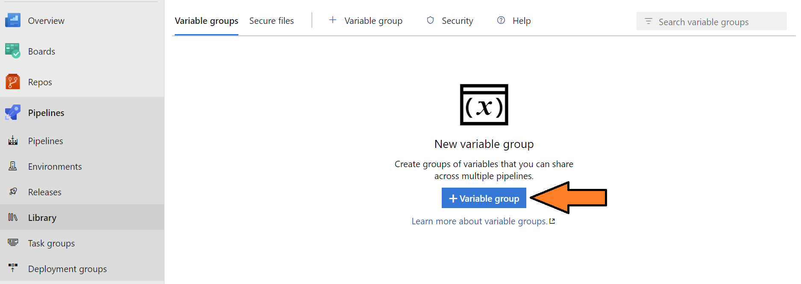

3. Create a variable group called "VisualTests" and add the following variables:

   - `CI` - Set to true and helps with logging of test results.
   - `CLIENT_ID` - The service principal's application/client ID.
   - `CLIENT_SECRET` - The client secret for the service principal.
   - `ENVIRONMENT` - The region your tenant is located in. The values can be Public, Germany, China, USGov, USGovHigh, or USGovDoD.
   - `TENANT_ID` - The Tenant GUID. You can locate it by following the instructions [at this link](https://learn.microsoft.com/en-us/sharepoint/find-your-office-365-tenant-id).

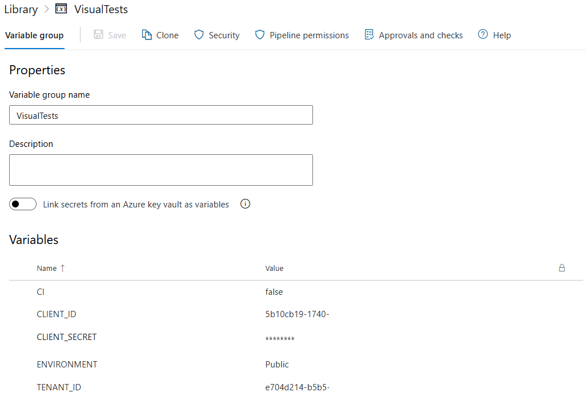

4. Save the variable group.

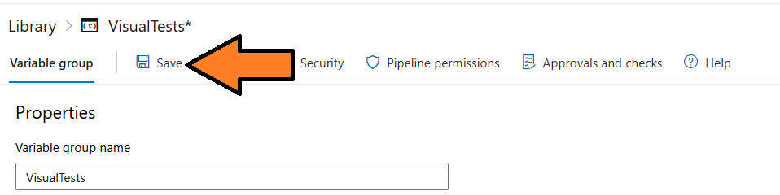

### Create the Pipeline

1. Navigate to the pipeline interface.

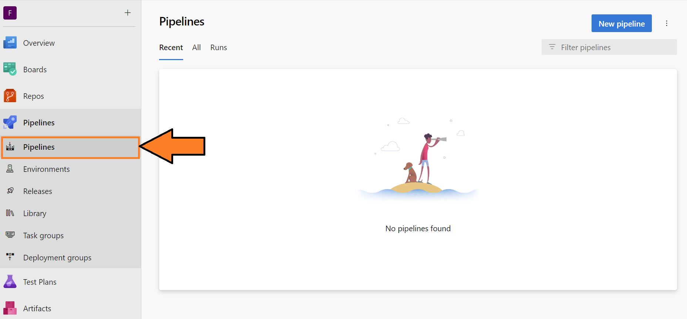

2. Select the "New Pipeline" button.

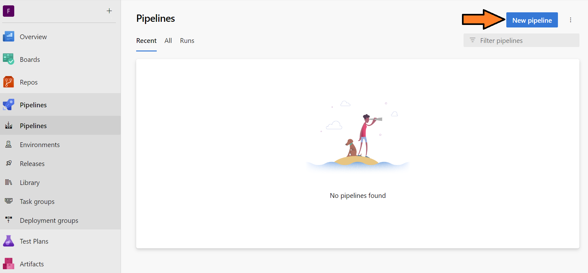

3. Select the **Azure Repos Git** option.

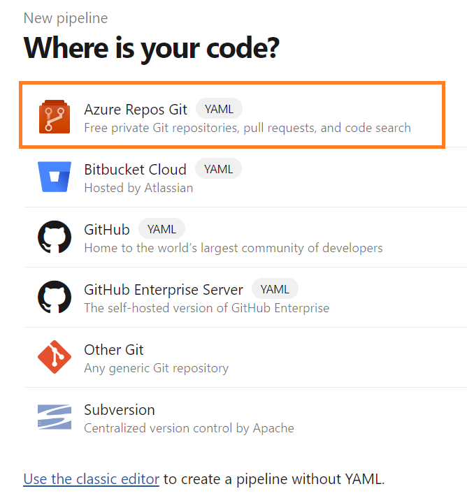

4. Select the repository you imported via the import process.

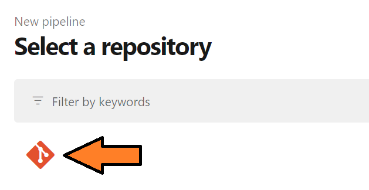

5. In the "Configure your pipeline" screen, select **Existing Azure Pipelines YAML file**.

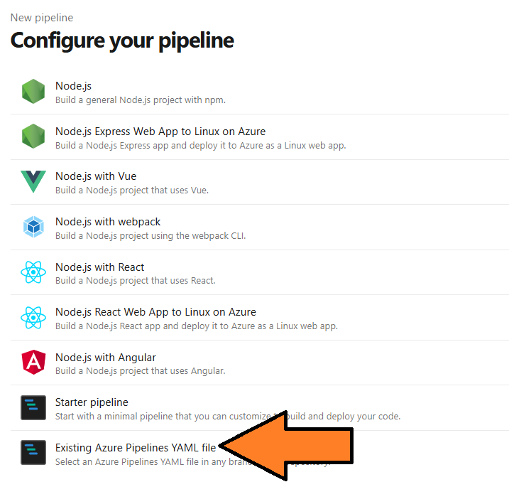

6. Select the branch 'main' and the path `/pipeline-scripts/playwright-docker-template.yml`. Select the **Continue** button.

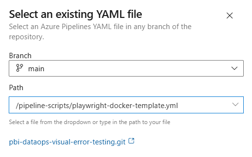

7. Select the "Run" button. If you make any updates to the triggers, you may see a "Save and Run" button.

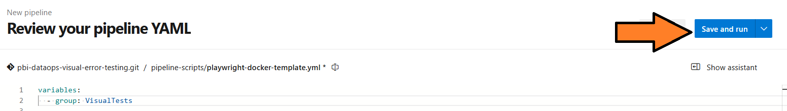

8. You will be prompted to commit to the main branch. Select the **Save and Run** button.

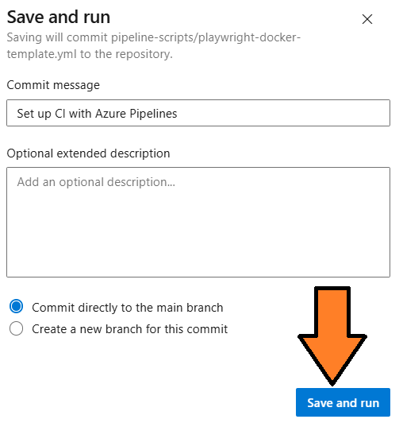

9. You will be redirected to the first pipeline run, and you will be asked to authorize the pipeline to access the variable group created previously. Select the **View** button.

10. A pop-up window will appear. Select the **View** button.

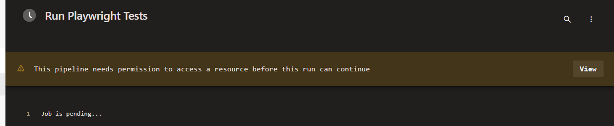

11. You will be asked to confirm. Select the **Permit** button.

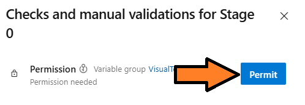

12. This will kick off the automated tests.

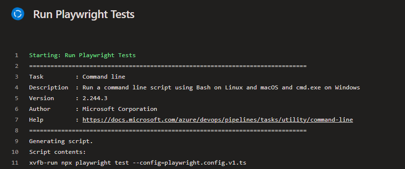

13. For any failed tests, this will be logged to the job, and the pipeline will also fail.

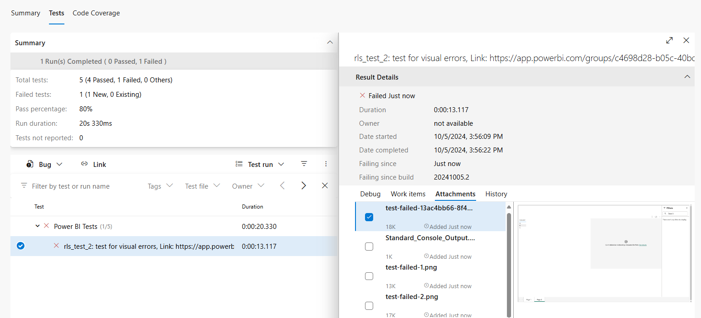

## Monitoring

It's essential to monitor the Azure DevOps pipeline for any failures. I've also written about some best practices for setting that up [in this article](https://www.kerski.tech/bringing-dataops-to-power-bi-part31/).
